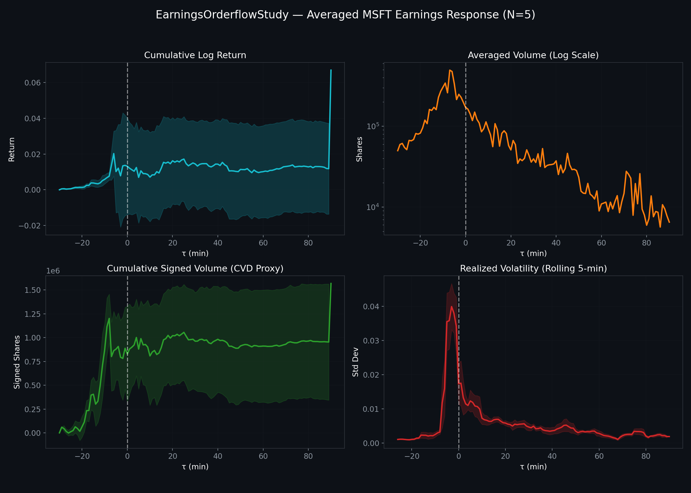

# EarningsOrderflowStudy

EarningsOrderflowStudy: A Minute-Level Event Study of Microsoft Earnings Announcements.

This project characterizes how MSFT's price, volume, and orderflow proxies respond in the minutes around the last 5 quarterly earnings announcements. It bridges the HawkesLOB framework conceptually to a real-world event-study application using Polygon minute bars and SEC 8-K filings.

## Features
- **Minute-level Resolution**: Characterizing microstructure response in extended-hours sessions.
- **Event Study Methodology**: Averaged response curves (MacKinlay 1997) with standard error bands.
- **News Features**: Loughran-McDonald sentiment analysis on SEC 8-K press releases and standardized EPS surprise.
- **Orderflow Proxies**: Tick-rule signed volume, Cumulative Volume Delta (CVD) proxy, and Corwin-Schultz spread estimates.

## Data Sources
- **Polygon.io**: Minute-bar OHLCV with extended hours.
- **SEC EDGAR**: 8-K filings and Exhibit 99.1 (Press Releases).
- **yfinance**: EPS actuals and consensus estimates.
- **Loughran-McDonald**: Financial sentiment master dictionary.

## Methodology
The study uses a window of `[t_event - 30 min, t_event + 90 min]` around each announcement. Orderflow is proxied via the Lee-Ready tick rule adapted for minute bars:
$$V^{\text{signed}}_t = V_t \cdot \text{sign}(P_t^{\text{close}} - P_{t-1}^{\text{close}})$$

## Reproducibility
1. Install dependencies: `pip install -r requirements.txt`
2. Set `POLYGON_API_KEY` environment variable.
3. Run acquisition: `python scripts/fetch_all.py`
4. Run analysis: Open `notebooks/01_analysis.ipynb`

## License
Apache 2.0