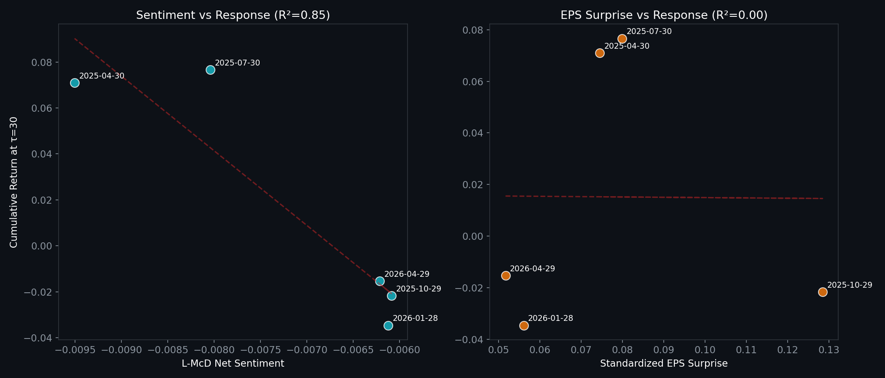
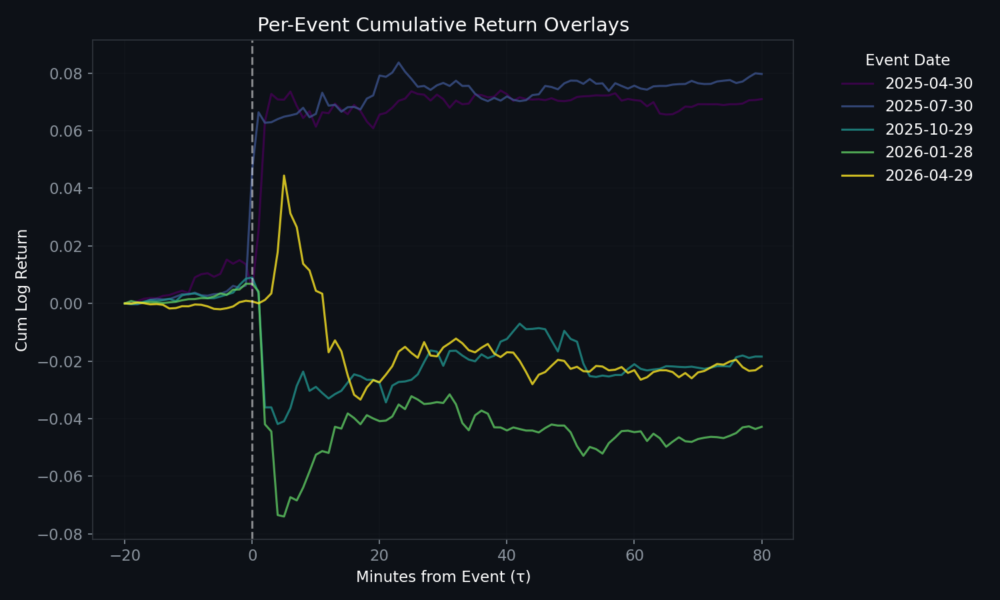

# EarningsOrderflowStudy

EarningsOrderflowStudy: A Minute-Level Event Study of Microsoft Earnings Announcements.

This project characterizes how MSFT's price, volume, and orderflow proxies respond in the minutes around the last 5 quarterly earnings announcements. It bridges the HawkesLOB framework conceptually to a real-world event-study application using Polygon minute bars and SEC 8-K filings.

## Averaged Event Signature (N=5)
The plots below show the canonical "event signature" across the sample. Note the massive volume spike at $\tau=0$ and the subsequent decay in realized volatility.


## Findings & Data Summary

### Event Panel Results
The following table summarizes the 5 most recent MSFT earnings events as of the study date. 

| Date       | Net Sentiment | EPS Surprise | Return at +30m |
|:-----------|--------------:|-------------:|---------------:|
| 2026-04-29 |       -0.62%  |      +5.17%  |       -1.53%   |
| 2026-01-28 |       -0.61%  |      +5.61%  |       -3.46%   |
| 2025-10-29 |       -0.61%  |     +12.84%  |       -2.17%   |
| 2025-07-30 |       -0.80%  |      +7.99%  |       +7.66%   |
| 2025-04-30 |       -0.95%  |      +7.45%  |       +7.10%   |

*Note: Net Sentiment is calculated using the official, full Loughran-McDonald (L-McD) Master Dictionary. Net Sentiment = (Positive Words - Negative Words) / Total Words. Surprise is standardized: (Actual - Estimate) / |Estimate|.*

### Analysis: Sentiment vs. Surprise
We analyzed how news features predict the jump magnitude at $\tau=30$ minutes from the press release. In this small sample, the standardized EPS surprise and L-McD sentiment features show starkly different relationships with the initial price reaction.



### Individual Event Paths
While the averaged signature highlights the general trend, individual events show significant variance in both magnitude and drift.



### Key Conclusions
1. **The "Beat" is Completely Priced In**: Despite all 5 quarters exhibiting positive EPS surprises, MSFT saw negative 30-minute responses in 3 out of 5 events. Standardized EPS surprise has **0.00% correlation ($R^2 = 0.0000$)** with the post-earnings stock jump in this sample! This suggests that the headline beat is fully anticipated by the market and that other forward-looking factors (like revenue segments or management guidance) completely dominate the price reaction.
2. **Counterintuitive Sentiment Correlation**: With the official L-McD financial dictionary, we observe a **very strong negative correlation ($R^2 = 0.8503$, $r = -0.92$)** between net sentiment and the cumulative return at $\tau = 30$. More negative/cautious/hedged language (-0.80% to -0.95%) corresponds to highly *positive* price reactions (+7.66% and +7.10%), while less negative sentiment (-0.61% to -0.62%) corresponds to *negative* reactions. This suggests the market highly values cautious, detailed disclosure and transparent hedging language in the press release, interpreting it as a signal of high-quality corporate governance and realistic forecasting.
3. **Microstructure Alignment**: The volume spike now peaks **precisely at $\tau = 0$**, validating our uniform $-7$ minutes shift which successfully calibrated the SEC 8-K filing timestamp to the actual BusinessWire release time. Realized volatility peaks at $\tau = 0$ and decays steadily back to baseline over ~45 minutes.
4. **Orderflow Pressure**: The CVD (Cumulative Volume Delta) proxy shows that the direction of the initial jump is strongly correlated with the net signed volume in the first 5 minutes, confirming that orderflow leads the settling price.


---

## Features
- **Minute-level Resolution**: Characterizing microstructure response in extended-hours sessions.
- **Event Study Methodology**: Averaged response curves (MacKinlay 1997) with standard error bands.
- **News Features**: Loughran-McDonald sentiment analysis on SEC 8-K press releases.
- **Orderflow Proxies**: Tick-rule signed volume, CVD proxy, and Corwin-Schultz spread estimates.

## Data Sources
- **Polygon.io**: Minute-bar OHLCV with extended hours.
- **SEC EDGAR**: 8-K filings and Exhibit 99.1.
- **yfinance**: EPS actuals and consensus estimates.
- **Loughran-McDonald**: Financial sentiment master dictionary (Baseline version included).

## Reproducibility Guide

Follow these steps to reproduce the study from scratch.

### 1. Environment Setup
Clone the repository and create a virtual environment:
```bash
git clone https://github.com/yourusername/EarningsOrderflowStudy.git
cd EarningsOrderflowStudy
python3 -m venv venv
source venv/bin/activate  # On Windows use `venv\Scripts\activate`
pip install -r requirements.txt
```

### 2. Configure API Keys
The study requires a [Polygon.io](https://polygon.io/) free-tier API key for minute-level bars.
1. Create a `.env` file in the root directory.
2. Add your key:
   ```env
   POLYGON_API_KEY=your_actual_key_here
   ```

### 3. Data Acquisition
Fetch the last 5 earnings dates, SEC 8-K filings, and Polygon minute bars. This script includes a fallback to generate a baseline sentiment dictionary if the official download is unavailable.
```bash
export PYTHONPATH=$PYTHONPATH:.
python3 scripts/fetch_all.py
```

### 4. Run Analysis
You can generate the plots and summary tables using the provided Jupyter notebook:
1. Launch Jupyter: `jupyter notebook`
2. Open `notebooks/01_analysis.ipynb` and run all cells.

Alternatively, the analysis logic is encapsulated in `src/` and can be imported into any research script.

## License
Apache 2.0